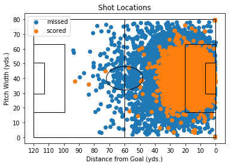
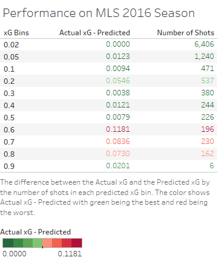
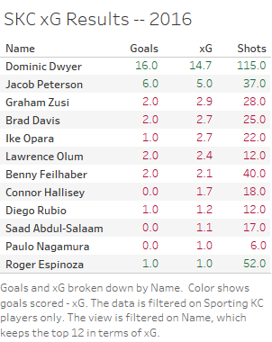
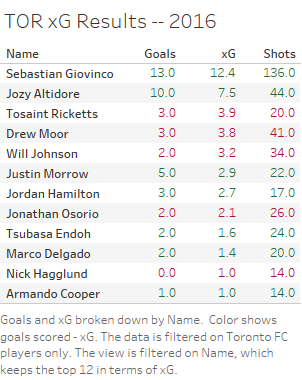

### Introduction to Expected Goals (xG) ###
The idea behind an xG model is to assign a probability to every shot. In terms of usefulness for teams, using xG rather than actual goals is an accurate predictor of future results of the team and specific players. Clubs can utilize xG to maximizing their spending in the transfer market or free agency. Using xG as a supplement to scouting can help teams to accurately predict the value and contributions a player could give them.

### My Model ###
* The period the shot was taken during the game to factor in the game flow and game state. In other words, this is an attempt at adjusting for the defensive pressure or the urgency for one team to score at the end of the game.

* The x and y location on the field of where the shot was taken. This is a key for all xG models, but I’m considering adjusting this or creating a new feature that factors in the angle of the shot.

* The location of where the shot crossed the end line also called the goal mouth location. This can either be a goal, saved by the goalie, hit the post of the goal or just a complete miss. This helps the model adjust for the quality of the shot taken, for example a shot that goes towards either corner of the goal has a better chance than a shot in the middle directly at the goalie. 

* If the shot was a header or not, also factors into my model. Headers are rated as a lower quality shot because it’s harder to control.

* I tried to factor in the player skill by factoring in whether the player that took the shot started the game or not. I’m looking to improve this feature by assigning a skill rating for each player, but I’m still considering the best way to do this. 

* The model also adjusts for whether the team taking the shot was home or away. This helps my model adjust for the playing style of teams at home and on the road. On the road, lots of teams tend to play not to lose and may not be as aggressive. 

### Technical Aspects, Performance and the Dataset ###
I created the model in Python and it uses an ensemble method by combining a Random Forest Classifier and Gaussian Naive Bayes model. I tinkered with multiple models like Logistic Regression and an Extreme Gradient Boosting model, but ended up having the most success with that combination. I calibrated the probabilities from the model using the isotonic method. 

I used a couple different methods to test my model and check the performance of it. I used ROC AUC, Log Loss and the Mean Squared Error in terms of technical scoring methods. The most important test of the performance to me was to predict the actual amount of goals scored against the sum of all the xG probabilities. I created bins of the xG values and compared them to the actual xG for the 2016 MLS season which can be seen below. The minimum expectation for all xG models should be to outperform the standard goal conversion rate which is about 9.5%. I’m still considering the bins that were of concern to see if there was an issue in my model.

I collected my data with Python scraping tools and used them on Squawka.com. They store these stats in XML files and the data was originally provided by Opta. I stored the data in a MySQL database, and had over 200,000 shots gathered between 2013-2016 from the MLS, Premier League, La Liga, Ligue 1, Serie A and Bundesliga. The dataset only includes shots from open play, which means penalty kicks and free kicks are not included. 

### Limitations ### 
The biggest limitation for xG is not having the defender location data to see how close the defender is to the ball. Opta doesn’t have this data or at least they don’t make it available to Squawka. The other downside to my xG model specifically is I don’t have the passing data factored into my model, so the type of pass could easily alter the quality of the shot. In general, xG is difficult to apply to players who don’t shoot a lot. I’m looking forward to working on other models to be used side by side with xG models. 

### Sporting KC Comparison ###
The two visuals below are comparing the top 12 players in terms of xG for Sporting KC and the 2016 MLS Champions, Toronto FC. Note again, that all the xG and goal values do not include free kicks or penalties. When comparing xG between players I like to look at if a player outperformed the expected goals value according to my model. This doesn’t always mean they are the better player because it’s possible they outperformed the xG because of luck or a goalkeeper error. 

SKC relied heavily on Dwyer while most role players underperformed their xG. I’m not surprised Peterson outperformed his xG because in 2016 he had a couple goals from headers which usually have a low probability of scoring. Peterson could have easily missed some of those difficult headers, so his performance could be deceiving. Toronto FC had two players carrying the scoring load and multiple other players outscoring their expectations. This doesn’t tell the entire story, but it’s a useful tool to build on for soccer clubs. 

